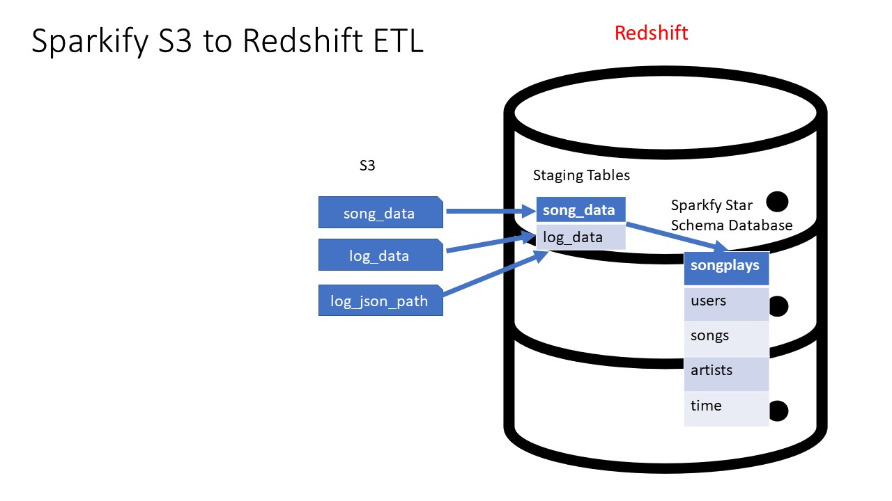
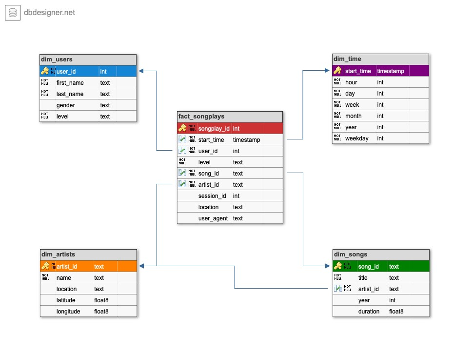

# udacity-dend-project-3
Udacity Data Engineer Nano Degree - Project-3 (Data Warehouse)

# Project: Building a cloud Data Warehouse

## Introduction
A music streaming startup, Sparkify, has grown their user base and song database and want to move their processes and data onto the cloud. Their data resides in S3, in a directory of JSON logs on user activity on the app, as well as a directory with JSON metadata on the songs in their app.

As their data engineer, you are tasked with building an ETL pipeline that extracts their data from S3, stages them in Redshift, and transforms data into a set of dimensional tables for their analytics team to continue finding insights in what songs their users are listening to. You'll be able to test your database and ETL pipeline by running queries given to you by the analytics team from Sparkify and compare your results with their expected results.


<figure>
  
</figure>

## Quick start

First, rename dwh_template.cfg to dwh.cfg and fill in the open fields. Fill in AWS acces key (KEY) and secret (SECRET).

To access AWS, you need to do in AWS the following:

* create IAM user (e.g. dwhuser)
* create IAM role (e.g. dwhRole) with AmazonS3ReadOnlyAccess access rights
* get ARN
* create and run Redshift cluster (e.g. dwhCluster => HOST)`.
---

## Project Description

Application of Data warehouse and AWS to build an ETL Pipeline for a database hosted on Redshift Will need to load data from S3 to staging tables on Redshift and execute SQL Statements that create fact and dimension tables from these staging tables to create analytics

## The data source is publicly provided by udacity on the following public buckets:

* LOG_DATA='s3://udacity-dend/log_data'
* LOG_JSONPATH='s3://udacity-dend/log_json_path.json'
* SONG_DATA='s3://udacity-dend/song_data'

These are located in dwh.cfg file on this project.

### **Song Dataset**
Songs dataset is a subset of [Million Song Dataset](http://millionsongdataset.com/).

Sample Record :
```
{"num_songs": 1, "artist_id": "ARJIE2Y1187B994AB7", "artist_latitude": null, "artist_longitude": null, "artist_location": "", "artist_name": "Line Renaud", "song_id": "SOUPIRU12A6D4FA1E1", "title": "Der Kleine Dompfaff", "duration": 152.92036, "year": 0}
```

### **Log Dataset**
Logs dataset is generated by [Event Simulator](https://github.com/Interana/eventsim).

Sample Record :
```
{"artist": null, "auth": "Logged In", "firstName": "Walter", "gender": "M", "itemInSession": 0, "lastName": "Frye", "length": null, "level": "free", "location": "San Francisco-Oakland-Hayward, CA", "method": "GET","page": "Home", "registration": 1540919166796.0, "sessionId": 38, "song": null, "status": 200, "ts": 1541105830796, "userAgent": "\"Mozilla\/5.0 (Macintosh; Intel Mac OS X 10_9_4) AppleWebKit\/537.36 (KHTML, like Gecko) Chrome\/36.0.1985.143 Safari\/537.36\"", "userId": "39"}
```

### Files used on the project:


The files in this repo should be run in the following order: 

1. **/RedshiftCluster/create_cluster.py** (Creates the redshift cluster)
2. **./etl/create_tables.py** (creates the necessary tables)
3. **./etl/etl.py**  (Copies the data and inserts it into the star schema)
4. **./etl/analytical_queries.py** (runs some queries on the tabes created)
4. **./etl/delete_cluster.py** (deletes the redshift cluster)

Additional files:

1. **./RedshiftCluster/cluster_status.py** (checks the cluster status)
2. **./etl/sql_queries.py** (Houses all the queries the create, copy, drop, insert and count)


## Project Structure

```
Cloud Data Warehouse
|___Redshift cluster folder Contains 3 files in regards to set up and delete redshift clusters
|____dwh.cfg             # AWS configuration file

ETL folder contains 4 files:

|____create_tables.py    # database/table creation script 
|____etl.py              # ELT builder - (Copies the data and inserts it into the star schema)
|____sql_queries.py      # (Houses all the queries the create, copy, drop, insert and count)
|____analytical_queries.py #(runs some queries on the tabes created)
```


## ELT Pipeline
### etl.py
ELT pipeline builder

1. `load_staging_tables`
	* Load raw data from S3 buckets to Redshift staging tables
2. `insert_tables`
	* Transform staging table data to dimensional tables for data analysis

### create_tables.py
Creating Staging, Fact and Dimension table schema

1. `drop_tables`
2. `create_tables`

### sql_queries.py
SQL query statement collecitons for `create_tables.py` and `etl.py`

1. `*_table_drop`
2. `*_table_create`
3. `staging_*_copy`
3. `*_table_insert`

### analytical_queries.py
(runs some queries on the tabes created)


## About Database

Sparkify analytics database (called here sparkifydb) schema has a star design. Start design means that it has one Fact Table having business data, and supporting Dimension Tables. The Fact Table answers one of the key questions: what songs users are listening to. DB schema is the following:
 
<figure>
  
</figure>


## Database schema design

### Staging tables

- **staging_events**: stores data extracted from JSON logs on user activity. Columns: *artist, auth, firstName, gender, itemInSession, lastName, length, level, location, method, page, registration, sessionId, song, status, ts, userAgent, userId*
- **staging_songs**: stores data extracted from JSON metadata on the songs in the app. Columns: *num_songs, artist_id, artist_latitude, artist_longitude, artist_location, artist_name, song_id, title, duration, year*

### Analytical tables

- **Fact Table**
  - **songplays**: records in event data associated with song plays i.e. records with page NextSong. Columns: *songplay_id, start_time, user_id, level, song_id, artist_id, session_id, location, user_agent*
- **Dimension Tables**
  - **users**: users in the app. Columns: *user_id, first_name, last_name, gender, level*
  - **songs**: songs in music database. Columns: *song_id, title, artist_id, year, duration*
  - **artists**: artists in music database. Columns: *artist_id, name, location, latitude, longitude*
  - **time**: timestamps of records in songplays broken down into specific units. Columns: *start_time, hour, day, week, month, year, weekday*


### Staging tables
```
staging_events
    artist VARCHAR,
    auth VARCHAR,
    firstName VARCHAR,
    gender CHAR(1),
    itemInSession INT,
    lastName VARCHAR,
    length FLOAT,
    level VARCHAR,
    location TEXT,
    method VARCHAR,
    page VARCHAR,
    registration VARCHAR,
    sessionId INT,
    song VARCHAR,
    status INT,
    ts BIGINT,
    userAgent TEXT,
    userId INT

staging_songs
    artist_id VARCHAR,
    artist_latitude FLOAT,
    artist_location TEXT,
    artist_longitude FLOAT,
    artist_name VARCHAR,
    duration FLOAT,
    num_songs INT,
    song_id VARCHAR,
    title VARCHAR,
    year INT
```

#### Fact Table
**songplays** - records in log data associated with song plays i.e. records with page NextSong
- songplay_id (INT) PRIMARY KEY: ID of each user song play 
- start_time (DATE) NOT NULL: Timestamp of beggining of user activity
- user_id (INT) NOT NULL: ID of user
- level (TEXT): User level {free | paid}
- song_id (TEXT) NOT NULL: ID of Song played
- artist_id (TEXT) NOT NULL: ID of Artist of the song played
- session_id (INT): ID of the user Session 
- location (TEXT): User location 
- user_agent (TEXT): Agent used by user to access Sparkify platform

#### Dimension Tables
**users** - users in the app
- user_id (INT) PRIMARY KEY: ID of user
- first_name (TEXT) NOT NULL: Name of user
- last_name (TEXT) NOT NULL: Last Name of user
- gender (TEXT): Gender of user {M | F}
- level (TEXT): User level {free | paid}

**songs** - songs in music database
- song_id (TEXT) PRIMARY KEY: ID of Song
- title (TEXT) NOT NULL: Title of Song
- artist_id (TEXT) NOT NULL: ID of song Artist
- year (INT): Year of song release
- duration (FLOAT) NOT NULL: Song duration in milliseconds

**artists** - artists in music database
- artist_id (TEXT) PRIMARY KEY: ID of Artist
- name (TEXT) NOT NULL: Name of Artist
- location (TEXT): Name of Artist city
- lattitude (FLOAT): Lattitude location of artist
- longitude (FLOAT): Longitude location of artist

**time** - timestamps of records in songplays broken down into specific units
- start_time (DATE) PRIMARY KEY: Timestamp of row
- hour (INT): Hour associated to start_time
- day (INT): Day associated to start_time
- week (INT): Week of year associated to start_time
- month (INT): Month associated to start_time 
- year (INT): Year associated to start_time
- weekday (TEXT): Name of week day associated to start_time


## HOWTO use

**Project has two scripts:**

* **create_tables.py**: This script drops existing tables and creates new ones.
* **etl.py**: This script uses data in s3:/udacity-dend/song_data and s3:/udacity-dend/log_data, processes it, and inserts the processed data into DB.

### Prerequisites

Python3 is recommended as the environment. The most convenient way to install python is to use Anaconda (https://www.anaconda.com/distribution/) either via GUI or command line.
Also, the following libraries are needed for the python environment to make Jupyter Notebook and AWS Redshift to work:

* _AWS SDK (boto3)_ (+ dependencies) to enable scripts and Jupyter to connect to AWS Redshift DB. (See https://boto3.amazonaws.com/v1/documentation/api/latest/index.html)
* _jupyter_ (+ dependencies) to enable Jupyter Notebook.
* _ipython-sql_ (https://anaconda.org/conda-forge/ipython-sql) to make Jupyter Notebook and SQL queries to AWS Redshift work together. NOTE: you may need to install this library from command line.

### Run create_tables.py

Type to command line:

`python3 create_tables.py`

* All tables are dropped.
* New tables are created: 2x staging tables + 4x dimensional tables + 1x fact table.
* Output: Script writes _"Tables dropped successfully"_ and _"Tables created successfully"_ if all tables were dropped and created without errors.

### Run etl.py

Type to command line:

`python3 etl.py`

* Script executes AWS Redshift COPY commands to insert source data (JSON files) to DB staging tables.
* From staging tables, data is further inserted to analytics tables.
* Script writes to console the query it's executing at any given time and if the query was successfully executed.
* In the end, script tells if whole ETL-pipeline was successfully executed.

Output: raw data is in staging_tables + selected data in analytics tables.

## Data cleaning process

`etl.py`works the following way to process the data from source files to analytics tables:

* Loading part of the script (COPY from JSON to staging tables) query takes the data as it is.
* When inserting data from staging tables to analytics tables, queries remove any duplicates (INSERT ... SELECT DISTINCT ...).

## Example queries

* Get users and songs they listened at particular time. Limit query to 1000 hits:

```
SELECT  sp.songplay_id,
        u.user_id,
        s.song_id,
        u.last_name,
        sp.start_time,
        a.name,
        s.title
FROM songplays AS sp
        JOIN users   AS u ON (u.user_id = sp.user_id)
        JOIN songs   AS s ON (s.song_id = sp.song_id)
        JOIN artists AS a ON (a.artist_id = sp.artist_id)
        JOIN time    AS t ON (t.start_time = sp.start_time)
ORDER BY (sp.start_time)
LIMIT 1000;
```

* Get count of rows in staging_songs table:

```
SELECT COUNT(*)
FROM staging_songs;
```

* Get count of rows in songplays table:

```
SELECT COUNT(*)
FROM songplays;
```

## Summary

Project-3 provides customer startup Sparkify tools to analyse their service data and help them answer their key business questions like "Who listened which song and when?" Basically, you will enter the AWS information in dwh.cfg and create clusters then createtables.py followed by etl.py and perform any data analysis for the analytics team.
